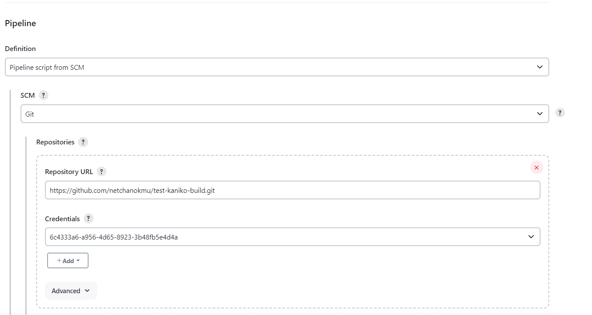
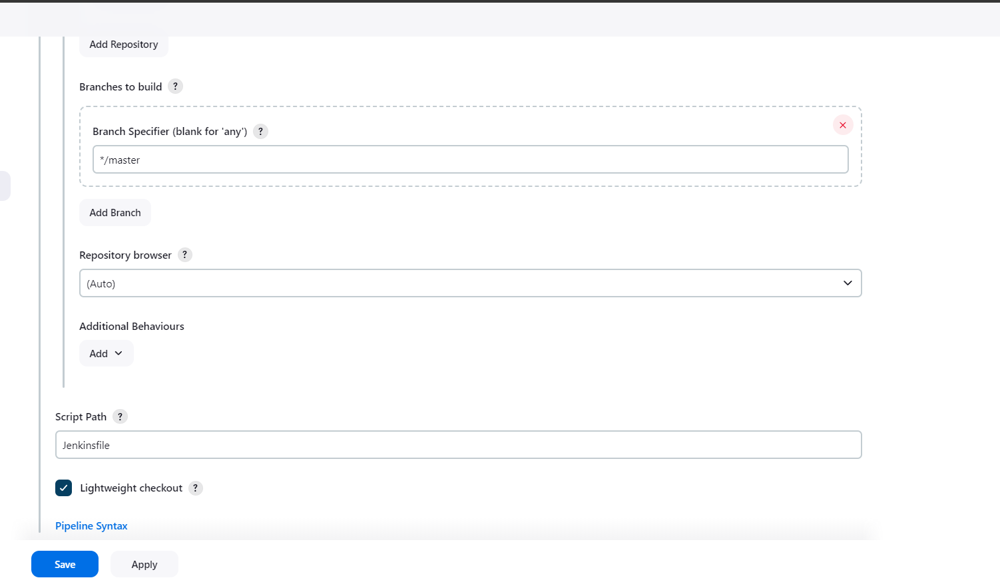

# ตัวอย่างการใช้ Kaniko build & push docker image  และใช้คำสั่ง kubectl ใน Jenkins pipeline
<!-- ## Table of Contents
- [Installation](#installation)
- [Usage](#usage)
- [Contributing](#contributing)
- [License](#license) -->

## Part 1: ใน Kubernetes Cluster
### 1.1 สร้าง secret สำหรับ authen docker registry ใน kubernetes cluster

แทนค่า username, password และ email ด้วยข้อมูลจริง และรันคำสั่งข้างล่าง
```bash
kubectl create secret docker-registry docker-credentials \  
    --docker-username=<username>  \
    --docker-password=<password> \
    --docker-email=<email>
```
## Part 2: ส่วนของ Repository ที่จะเก็บ Jenkinsfile, Dockerfile และ yaml file สำหรับการสร้าง Deployment
### 2.1 สร้างไฟล์ kaniko-builder.yaml 
kaniko-builder.yaml
```yaml
kind: Pod
spec:
  containers:
  - name: kaniko
    image: gcr.io/kaniko-project/executor:debug
    imagePullPolicy: Always
    command:
    - sleep
    args:
    - 9999999
    volumeMounts:
      - name: jenkins-docker-cfg
        mountPath: /kaniko/.docker
    resources:
      requests:
        memory: "256Mi"  
        cpu: "256m"      
      limits:
        memory: "512Mi"  
        cpu: "512m"      
  volumes:
  - name: jenkins-docker-cfg
    projected:
      sources:
      - secret:
          name: docker-credentials
          items:
            - key: .dockerconfigjson
              path: config.json
```
### 2.2 สร้างไฟล์ kubectl-agent.yaml
kubectl-agent.yaml
```yaml
apiVersion: v1
kind: Pod
metadata:
  labels:
    type: jenkins-agent
spec:
  containers:
  - name: kubectl
    image: bitnami/kubectl:latest
    command:
      - "/bin/sh"
      - "-c"
      - "sleep 99d"
    tty: true
    securityContext:
      runAsUser: 0
    resources:
      requests:
        memory: "256Mi"  
        cpu: "256m"      
      limits:
        memory: "512Mi"  
        cpu: "512m"
  restartPolicy: Never
```
### 2.3 สร้าง Clusterrolebinding ใน kubecluster เพื่อให้สามารถใช้คำสั่ง kubectl ได้
```yaml
apiVersion: rbac.authorization.k8s.io/v1
kind: ClusterRoleBinding
metadata:
  name: fabric8-rbac
subjects:
  - kind: ServiceAccount
    name: default
    namespace: cicd
roleRef:
  kind: ClusterRole
  name: cluster-admin
  apiGroup: rbac.authorization.k8s.io
```
### 2.4 สร้าง Jenkinsfile 
Jenkinsfile
```yaml
pipeline {
  agent any
  environment {
        APP_NAME = "helloworld-app"
        RELEASE = "1.0.0"
        DOCKER_USER = credentials('DOCKER_USER')
        DOCKER_PASS = credentials('DOCKER_PASS')
        IMAGE_NAME = "${DOCKER_USER}" + "/" + "${APP_NAME}"
        IMAGE_TAG = "${RELEASE}-${BUILD_NUMBER}"
        /* JENKINS_API_TOKEN = credentials("JENKINS_API_TOKEN") */

    }

  stages {

    stage("Cleanup Workspace") {
      steps {
        cleanWs()
      }
    }

    stage("Checkout from SCM"){
            steps {
                git branch: 'master', credentialsId: '6c4333a6-a956-4d65-8923-3b48fb5e4d4a', url: 'https://github.com/netchanokmu/test-kaniko-build.git'
            }
        }


    stage('Build & Push with Kaniko') {
      agent {
        kubernetes {
            yamlFile 'kaniko-builder.yaml'
        }
      }
      steps {
        container(name: 'kaniko', shell: '/busybox/sh') {
          sh '''#!/busybox/sh

            /kaniko/executor --dockerfile `pwd`/Dockerfile --context `pwd` --destination=${IMAGE_NAME}:${IMAGE_TAG} --destination=${IMAGE_NAME}:latest
          '''
        }
      }
    }

    stage('Deploy with Kubernetes') {
      agent {
        kubernetes {
            yamlFile 'kubectl-agent.yaml'
        }
      }
      steps {
        container(name: 'kubectl', shell: '/bin/sh') {
          sh '''#!/bin/sh
            kubectl apply -f deployment.yaml
          '''
        }
      }
    }
}
}
```
จากตัวอย่าง Jenkinsfile ข้างต้น สามารถปรับเปลี่ยนให้เหมาะสมตามข้อมูลความเป็นจริงของตัวเองได้

## Part 3: การสร้าง pipeline ใน Jenkins 

### 3.1 สร้าง pipeline โดยการ config เบื้องต้นได้ตามตัวอย่างข้อมูลข้างล่าง



### 3.2 Save และ  Build now


